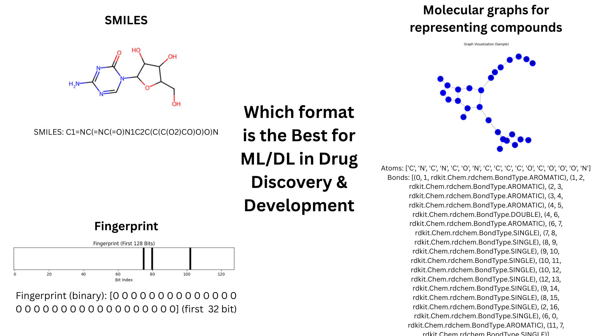

# Multi-Modal ADR Prediction

A research project focused on developing explainable deep learning models for **adverse drug reaction (ADR) prediction** in pediatric oncology. The pipeline integrates **chemical structure data (SMILES, molecular fingerprints)** and **gene expression profiles** to classify compound sensitivity using multi-modal learning strategies.

## Key Features:

- **Multi-modal architecture:** CNN for SMILES, MLP for fingerprints, and dual-branch fusion.
- **External validation:** Tested on CTRPv2.0 dataset for generalizability.
- **Interpretability:** SHAP analysis on CNN model highlights influential chemical substructures.
- **Data science pipeline:** Includes EDA, feature standardization, outlier detection, and stratified splits.
- **Biomedical context:** Focus on pediatric cancer treatment, drug sensitivity profiling, and ethical AI.

